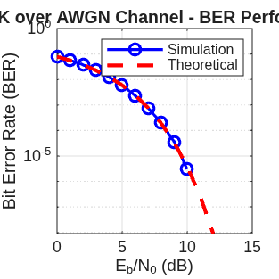

# حقيبة محاكاة أنظمة الاتصالات ومعالجة الإشارات الرقمية باستخدام MATLAB

## 1. مقدمة عن المشروع
تضم هذه الحقيبة الهندسية مجموعة متكاملة من بيئات المحاكاة والشفرات البرمجية المطورة باستخدام لغة **MATLAB**. تم بناء هذه الأكواد لتغطية المراحل الأساسية والمتقدمة في هندسة الاتصالات الرقمية، معالجة الإشارات، ونظرية الاحتمالات، مما يمنح فهماً عميقاً لسلوك الإشارات وتأثير القنوات اللاسلكية والضوضاء على جودة البيانات المستلمة.

## 2. الهيكل البرمجي للمشروع (Project Structure)
تم تقسيم المشروع إلى مجلدات فرعية متخصصة لتسهيل التصفح والمحاكاة:

### أ. أساسيات معالجة الإشارات الرقمية (Signal Processing Basics)
يحتوي هذا المجلد على أكواد توليد ودراسة الإشارات الأساسية:
* **توليد الإشارات الجيبية والنبضية:** إنشاء إشارات المستطيل $rect(t)$ والنبضات المختلفة لدراسة سلوكها الزمني والترددي.
* **نظرية الاعتيان (Sampling Theorem):** محاكاة عملية تحويل الإشارات التماثلية إلى رقمية والتحقق من شرط "نايكويست" ($f_s > 2f_m$) لتفادي حدوث التداخل الطيفي (Aliasing).

### ب. محاكاة أنظمة الاتصالات الرقمية (Digital Communications)

مخططات متقدمة لدراسة قنوات الإرسال واستقبال البيانات:
* **قناة الضوضاء البيضاء المضافة (AWGN Channel):** تمثيل السلوك الحقيقي لقنوات الإرسال بافتراض علاقة النموذج الرياضي:
  $$Y = X + N$$
  حيث $X$ هي الإشارة المرسلة و $N$ تمثل الضوضاء البيضاء ذات التوزيع الطبيعي (Gaussian Distribution).
* **قناة البت المتناظرة (Binary Symmetric Channel - BSC):** محاكاة احتمالية حدوث خطأ في البتات المرسلة ($0 \rightarrow 1$) أو ($1 \rightarrow 0$) نتيجة التداخل.
* **حساب معدل خطأ البت (BER Analysis):** أكواد مخصصة لمقارنة الأداء التجريبي للأنظمة (مثل BPSK) مع الأداء النظري.

### ج. الاحتمالات والإحصاء الهندسي (Probability & Statistics)
تطبيقات رياضية لمحاكاة المتغيرات العشوائية الحيوية في الاتصالات:
* **Matlab_statistics_basics.m:** كود شامل لحساب التوزيعات الإحصائية مثل توزيع برنولي ($Bernoulli$) ودوال الكثافة الاحتمالية ($PDF$) للضوضاء، والتي تُبنى على أساسها قرارات فك التشفير في المستقبلات اللاسلكية.

## 3. كيفية تشغيل واستخدام الأكواد
1. تأكد من تنصيب برنامج **MATLAB** (أو بيئة عمل متوافقة).
2. قم بتحميل المستودع بالكامل أو فتح المجلد الذي ترغب في اختبار كوده.
3. قم بتشغيل الملف الرئيسي داخل المجلد لمشاهدة المخططات الرسومية الناتجة (مثل منحنيات BER أو تمثيل الإشارات).

## 4. الخطط المستقبلية للتطوير
* إضافة محاكاة للأنظمة اللاسلكية متعددة الهوائيات ($MIMO$).
* إدراج أكواد محاكاة التعديل الرقمي المتقدم مثل $QAM$ و $OFDM$.
